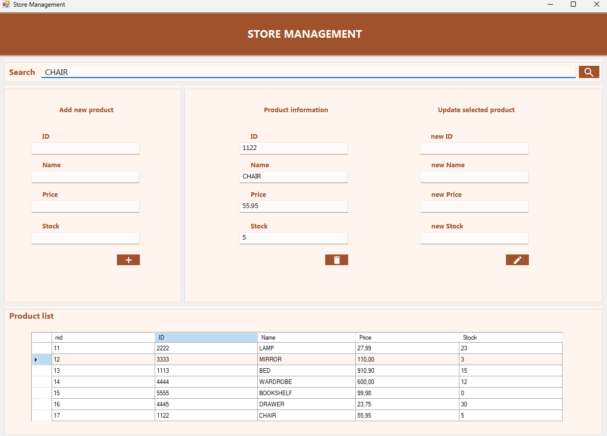

# 🛋️ StoreManager

Aplicación de **Windows Forms (.NET Framework)** para la gestión de productos de una tienda de muebles.  
Permite **crear, buscar, actualizar, eliminar y visualizar** muebles de la base de datos.

---

## 🚀 Características

- ➕ **Crear productos**: Añadir un mueble nuevo con ID, nombre, precio y stock.  
- 🔍 **Buscar productos**: Consultar por **ID o nombre**.  
- ✏️ **Actualizar productos**: Editar los datos de un mueble existente.  
- 🗑️ **Eliminar productos**: Borrar registros de la base de datos.  
- 📋 **Visualizar inventario**: Mostrar todos los muebles disponibles.  

---

## 🛠️ Tecnologías utilizadas

- **Lenguaje:** C#  
- **Interfaz:** Windows Forms  
- **Base de datos:** SQL Server (local)  
- **ORM:** LINQ to DB  
- **Arquitectura:** 3 capas (Presentación, Lógica, Datos)  

---

## 📸 Capturas de pantalla

- **Vista de la aplicación**
  
  

**Proyecto con fines de práctica en .NET, SQL Server y Arquitectura de 3 capas.**

